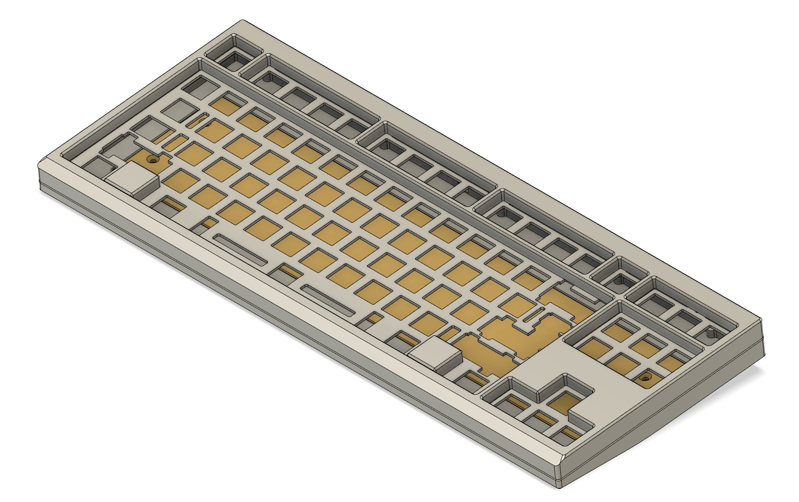
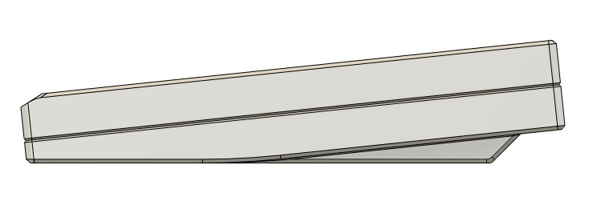
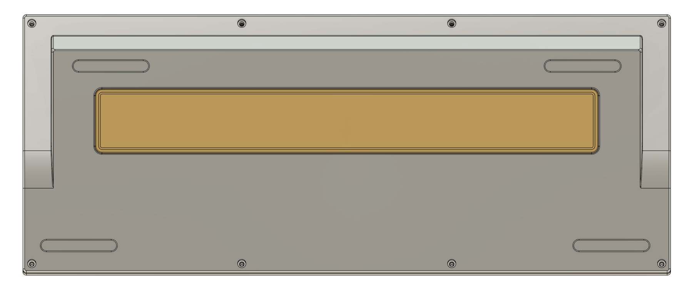

# WIP Name: Project Ashley
This keyboard was made as an attempt to practice my CAD skills and potentially create a keyboard I can hopefully get a prototype of eventually into the future. It borrows designs and features from a bunch of keyboards and ideas that I personally liked. Some inspirations include ideas from the TGR Jane, Geon Frog TKL, Promise87, and more.

